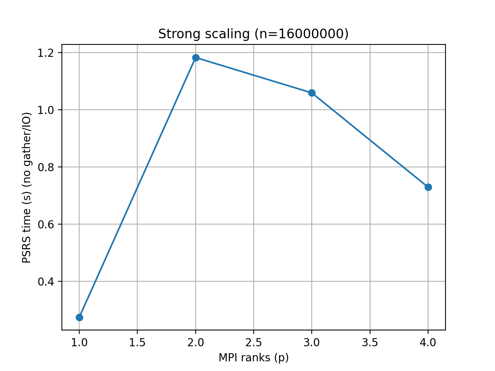
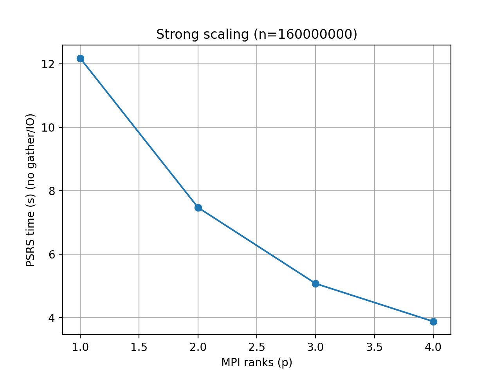
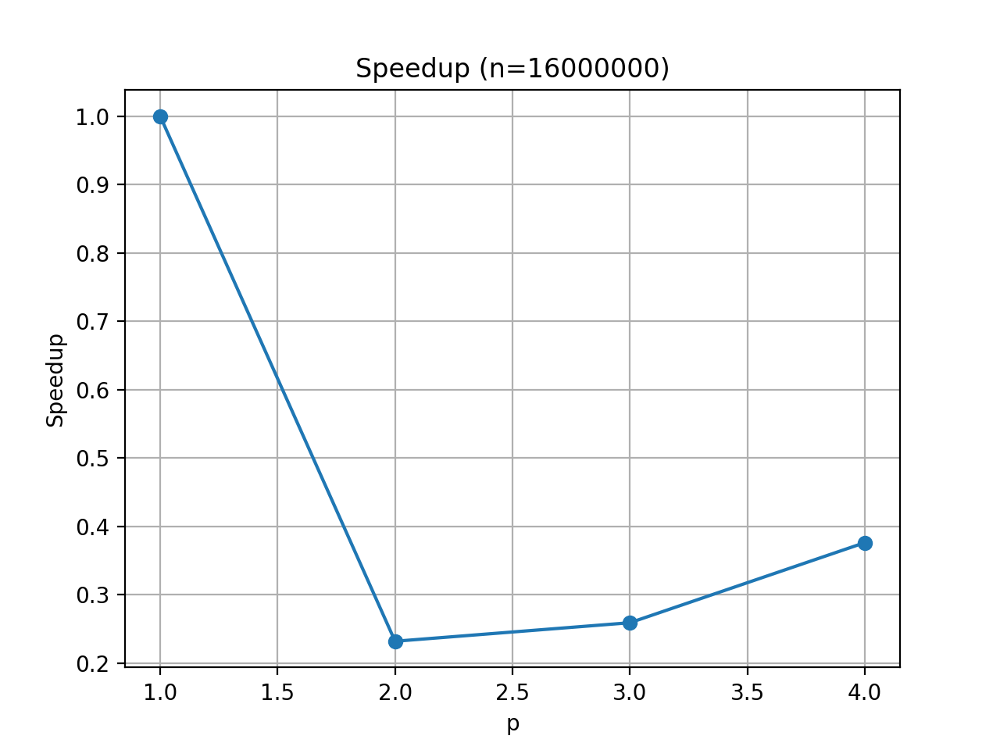
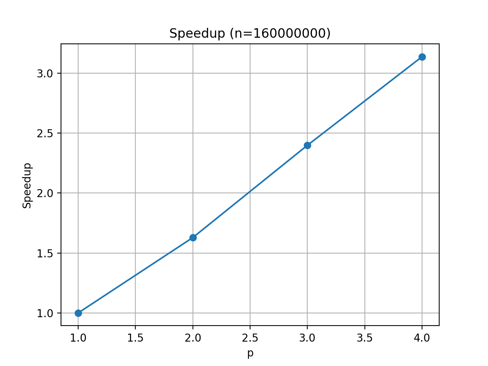
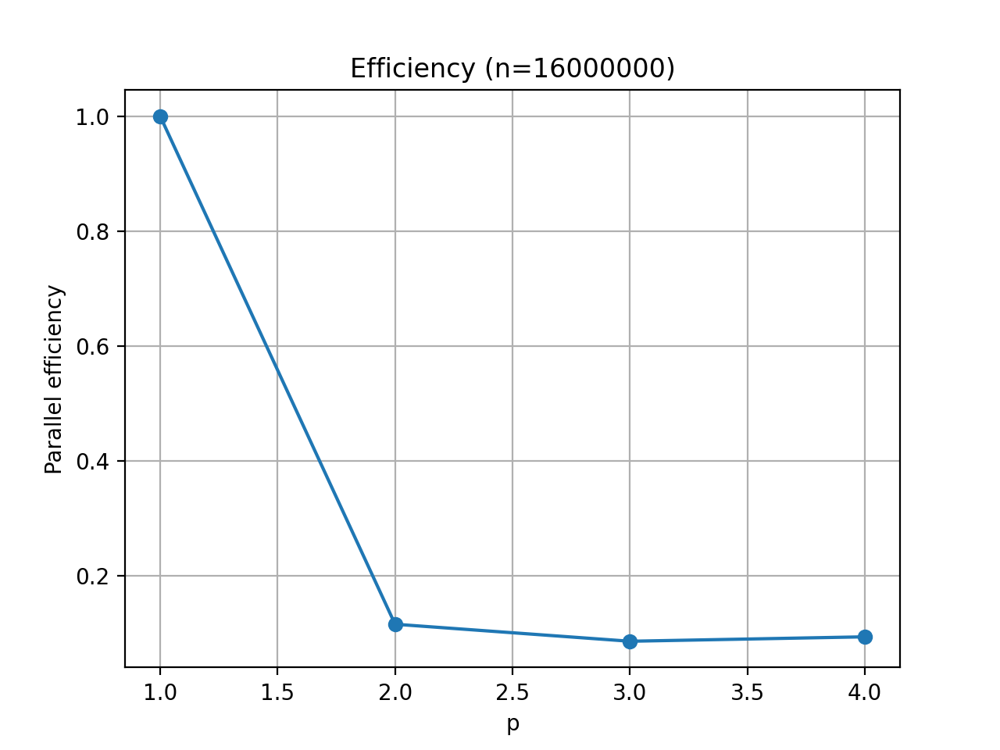
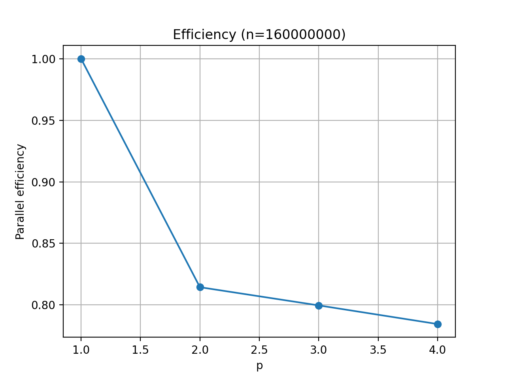

# PSRS MPI Implementation

MPI implementation of Parallel Sorting by Regular Sampling (PSRS).

## Description
This project implements PSRS using MPI and includes strong scaling
experiments measuring the PSRS phase runtime.

## Build / Run
Build by:
mpicc psrs_mpi.c -o "output_name"
Usage:
  mpirun -np P ./a.out [--n N] [--in input.txt] [--out output.csv] [--metrics metrics.csv]
        If --in is given: reads ints from file (CSV/whitespace separated). --n optionally truncates.
        If --in not given: generates N random ints (default N=INT_MAX).
        If metrics.csv file exists: writes after the last row.
        If output.csv file exists: --out writes on top of the same file.

## Notes
Timing excludes gathering of local partitions and I/O.

## Testing algorithm time results per rank

## Testing algorithm speedup by rank

## Testing algorithm efficiency by rank

